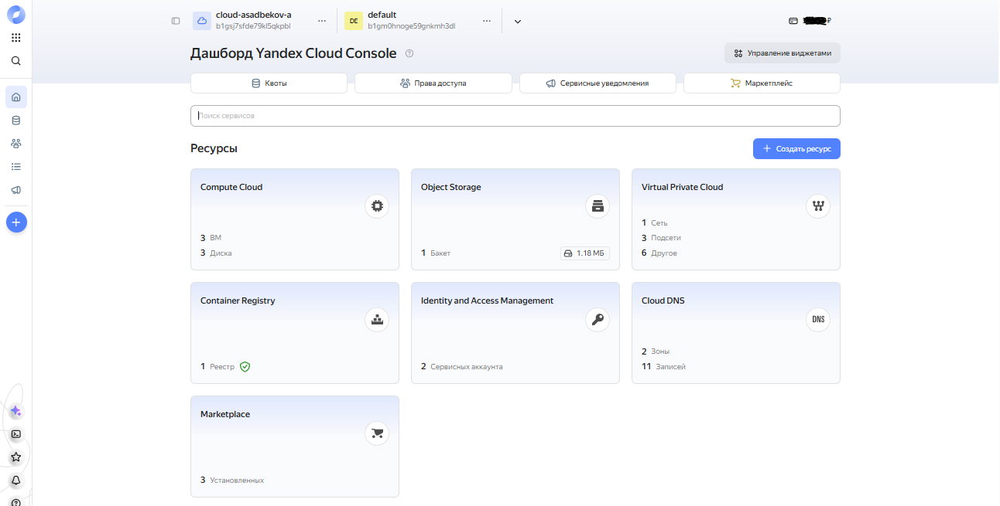
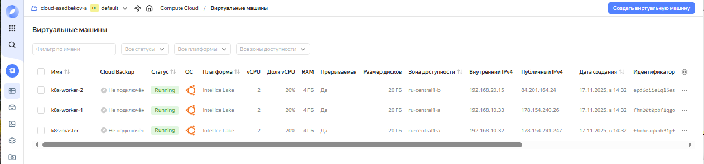
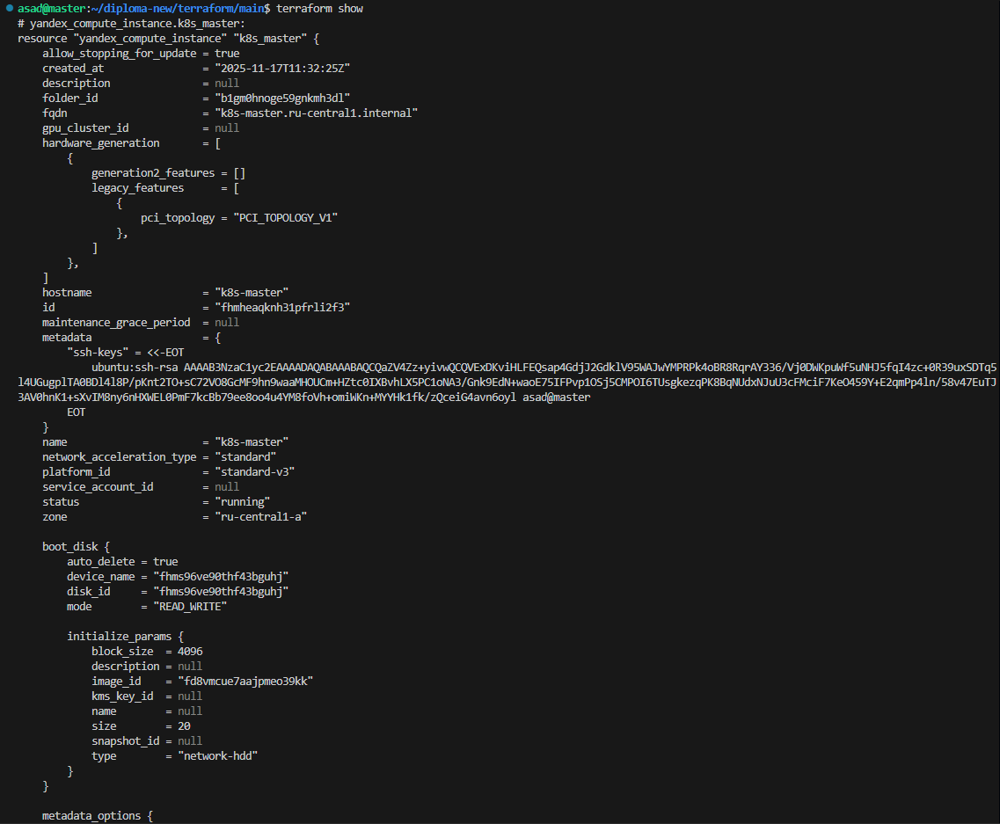

# DevOps Diploma Infrastructure

## Описание
Данный репозиторий содержит инфраструктурную часть дипломного проекта DevOps (Netology). Инфраструктура развернута в Yandex Cloud и предназначена для создания полноценной платформы для запуска Kubernetes-кластера, контейнерного реестра и сетевых ресурсов. Все компоненты описаны с использованием принципов Infrastructure as Code (IaC) через Terraform, что обеспечивает воспроизводимость, версионность и автоматизацию развертывания.

Проект реализует облачную инфраструктуру для запуска self-hosted Kubernetes кластера, который используется для деплоя тестового приложения, работы CI/CD pipeline и системы мониторинга.

---

## Предварительные требования
- **Yandex Cloud**
- **Kubernetes** (`self-hosted`, `kubeadm`, версия **1.27+**)
- ОС нод: **Ubuntu 22.04**
- Установленные инструменты:
  - `terraform`
  - `kubectl`
  - `git`
  
---

## Архитектура инфраструктуры
Инфраструктура построена на платформе Yandex Cloud и состоит из нескольких ключевых компонентов:

1. **Сетевой слой**: Virtual Private Cloud (VPC) с подсетями в разных зонах доступности для обеспечения отказоустойчивости и сетевой изоляции.

2. **Вычислительные ресурсы**: Виртуальные машины Compute Cloud, образующие Kubernetes кластер - одна master-нода и две worker-ноды. Kubernetes-кластер развёрнут с использованием kubeadm.

3. **Сервисы хранения**: Object Storage  — используется на этапе bootstrap для демонстрации подхода к хранению Terraform state. Container Registry — хранение Docker образов приложения.

4. **Управление доступом**: Сервисные аккаунты с минимально необходимыми правами для безопасного управления инфраструктурой.

---

## Terraform
Инфраструктура описана с помощью Terraform.

Структура репозитория:

```text
devops-diplom-infra/
├── prepare/ # Инициализационные конфигурации (bootstrap)
│ ├── main.tf # Создание сервисного аккаунта и бакета
│ ├── variables.tf # Переменные для начальной настройки
│ ├── outputs.tf # Выводы для использования в основном модуле
│ └── terraform.tfvars # Значения переменных (не коммитится)
├── production/ # Основная инфраструктура
│ ├── main.tf # Главный файл конфигурации
│ ├── backend.tf # Конфигурация бэкенда Terraform
│ ├── variables.tf # Параметры основной инфраструктуры
│ └── modules/ # Переиспользуемые модули Terraform
│ ├── vpc/ # Модуль создания VPC и подсетей
│ ├── compute/ # Модуль создания виртуальных машин
│ ├── registry/ # Модуль Container Registry
│ ├── alb/ # Модуль Application Load Balancer
│ ├── dns/ # Модуль DNS записей
│ └── k8s/ # Модуль Kubernetes (опционально)
├── ansible/ # Конфигурации Ansible для настройки ВМ
├── scripts/ # Вспомогательные скрипты
├── screenshots/ # Скриншоты для документации
└── README.md # Документация проекта

Некоторые модули (ALB, DNS) включены в репозиторий как задел для расширения инфраструктуры, но не используются в рамках дипломного проекта.
```
## Используемые сервисы Yandex Cloud
В проекте используются следующие сервисы Yandex Cloud:

- **Compute Cloud**: Виртуальные машины для Kubernetes кластера
- **Virtual Private Cloud (VPC)**: Сетевая инфраструктура с изоляцией
- **Container Registry**: Приватный реестр Docker образов
- **Object Storage**: Хранение state-файлов Terraform
- **Service Accounts**: Управление правами доступа к ресурсам
- **IAM**: Управление идентификацией и доступом

## Подход к развертыванию
Развертывание инфраструктуры выполняется в два этапа:

### Этап 1: Подготовительный (bootstrap)
```bash
cd prepare/
terraform init
terraform apply
```

### Этап 2: Основной (production)
На этом этапе развертывается основная инфраструктура:

```bash
cd ../production/
terraform init -backend-config="../prepare/backend.config"
terraform apply
```
На этом этапе развертывается вся остальная инфраструктура:
- VPC с тремя подсетями в разных зонах доступности
- Виртуальные машины для Kubernetes кластера (3 ноды)
- Container Registry для хранения образов приложения
- Сетевые правила и группы безопасности

---

## Виртуальные машины
Kubernetes-кластер развёрнут на виртуальных машинах:

- 1 master-нода
- 2 worker-ноды
- ноды размещены в разных зонах доступности

Это обеспечивает отказоустойчивость и соответствует best practices.

---

## Безопасность
В проекте реализованы следующие меры безопасности:
- сервисные аккаунты Yandex Cloud
- namespace-scoped доступ в Kubernetes для CI/CD
- изоляция сетей: VPC с настройкой групп безопасности
- минимальные привилегии: Сервисные аккаунты с точно определенными правами
- безопасное хранение секретов: Чувствительные данные хранятся в переменных окружения и .tfvars файлах (не коммитятся)
- внутренние сети: ВМ используют внутренние IP адреса, внешний доступ ограничен

---

## Скриншоты
В отчёте по дипломному проекту представлены скриншоты:
- списка виртуальных машин в Yandex Cloud
- статуса Kubernetes-нод
- состояния инфраструктуры после развёртывания

Созданные ресурсы в `Yandex Cloud`


Созданные виртуальные машины в `Yandex Cloud`


Состояние нод `Kubernetes`-кластер


Проверка инфраструктуры через Terraform

---

## Заключение
Данная инфраструктура обеспечивает надежную основу для развертывания и эксплуатации Kubernetes кластера в Yandex Cloud. Использование Terraform позволяет легко воспроизводить, изменять и масштабировать инфраструктуру, следуя принципам Infrastructure as Code.

## Лицензия
Проект распространяется под лицензией MIT. Подробнее см. в файле LICENSE.

## Связанные репозитории

1. **Приложение и CI/CD** - Приложение и CI/CD - тестовое приложение и pipeline развертывания
   - [devops-diplom-app](https://github.com/asad-bekov/devops-diplom-app)

2. **Kubernetes конфигурации** - манифесты для мониторинга, ingress
   - [devops-diplom-k8s](https://github.com/asad-bekov/devops-diplom-k8s)

---
